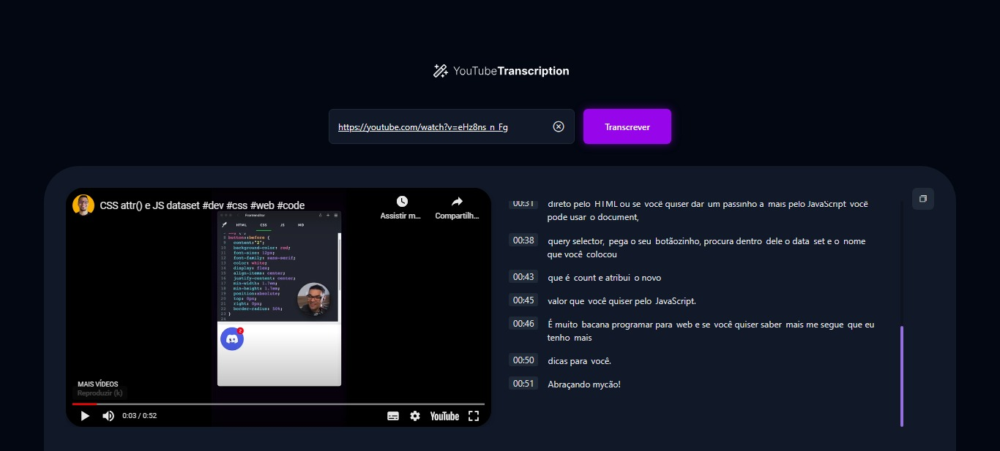

<h1 align="center"> 
Transcrição de vídeo com IA
</h1>

⚙️ Desenvolvimento de uma página de transcrição de vídeos do YouTube que utiliza IA para transcrever automaticamente. ⚙️

 

  

 

## 🛠 Tecnologias

Esse projeto foi desenvolvido com as seguintes tecnologias:

- **[HTML](https://developer.mozilla.org/pt-BR/docs/Web/HTML)**
- **[CSS](https://developer.mozilla.org/pt-BR/docs/Web/CSS)**
- **[Javascript](https://developer.mozilla.org/pt-BR/docs/Web/JavaScript)**
- **[Figma](https://www.figma.com/dev-mode/)**
- **[Front Editor](https://www.fronteditor.dev/gists/64e6ade5434ccd23e6ad89d50cafea3b/view)**
- **Blunder [Vite](https://vitejs.dev/)**
- **Pacote de Ícones [Phosphor Icons](https://phosphoricons.com/)**
- **[Youtube API](https://developers.google.com/youtube/iframe_api_reference#Getting_Started) API do youtube que permite incorporar um player de vídeo do YouTube em seu website e controlar o player usando o JavaScript.**
- **Link de vídeo para exemplo [CSS attr() e JS dataset](https://youtube.com/watch?v=eHz8ns_n_Fg)**
- **Módulo para criação de servidor leve `express`**
- **Módulo para acesso entre servidores `cors`**
- **Módulo para conexão com o backend `axios`**
- **Módulo para download de vídeo do youtube [YTDL](https://github.com/fent/node-ytdl-core)**
- **Sistema de Arquivos do NodeJS `fs (file system)`**
- **Ferramenta para a criação do mp3 [ffmpeg-static](https://creatomate.com/blog/how-to-use-ffmpeg-in-nodejs) O ffmpeg-estático fornece uma compilação estática do FFmpeg, para que você não precise se preocupar em instalá-lo manualmente na máquina onde você implantará seu aplicativo**
- **[fluent-ffmpeg](https://creatomate.com/blog/how-to-use-ffmpeg-in-nodejs) O FFMPEG-fluente nos dá uma interface simples para executar comandos FFmpeg a partir do JavaScript.**
- **Aprendizado de máquina de última geração para a web. [Transformers/Xenova](https://github.com/xenova/transformers.js) Execute 🤗 Transformers diretamente em seu navegador, sem a necessidade de um servidor!**
- **Ferramenta para transcrição de um determinado áudio para texto, 
`Automatic Speech Recognition (ASR)` ou `Speech to Text (STT)` possui muitas aplicações, como interfaces de usuário de voz.**

 

## 🚀 Como Utilizar

- Vite - Instalar e iniciar o Vite
 `npm create vite@latest`
 `npm run dev`
 Rota Padrão: `http://localhost:5173/`
- Instalar o express: `npm i express`
- Instalar o cors: `npm i cors`
- Adicionar o script `"server": "node server/index.js"` e iniciar com `npm run server`.
- Rota padrão para acessar o audio: `http://localhost:3333/audio?v=IDAQUI`
- Instalar o axios: `npm i axios`
- Instalar o ytdl-core:  `npm install ytdl-core@latest`
- Instalar o ffmpeg-static e o fluent-ffmpeg:  `npm i ffmpeg-static fluent-ffmpeg`
- Instalar o Transformers/Xenova:  `npm i @xenova/transformers`

 

## 🎲 DEMO

https://github.com/Ciro-TI-System/AI-Powered-Video-Transcription/assets/78507494/9686b15d-19b7-4327-9533-2d75c8ecab91

 

## 🎨 Layout

Você pode visualizar o layout  do projeto através [DESSE LINK](https://www.figma.com/community/file/1268564660141195165). É necessário ter conta no [Figma](https://figma.com) para acessá-lo.

 

## 📝 License

  

Esse projeto está sob a licença MIT.

 

### 👨‍💻 Autor

 
 <em>Ciro Batista da Silva<em>
 
  

 
👋🏽 Entre em contato!

 

